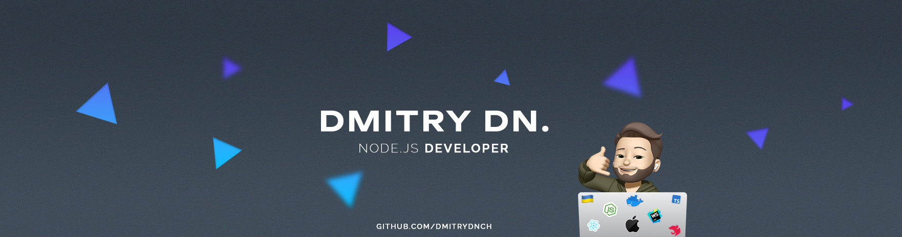

<h3 align="center">
    Hi! I'm <a href="https://linkedin.com/in/dmitry-dnch" target="_blank">Dmitry</a> 👋 - Full-stack developer
    

</h3>

I am developing, creating, solving, and designing with deep passion.
I love to make a contribution to the products I work on.
This motivates me to grow as a professional and share my knowledge.

## 🧭 About me

- 🌍 I'm based in Sacramento, CA
- 🚀 I'm currently working in [IvorySoft](http://ivorysoft.co)
- ✉️ My email: [dmitry.developer@protonmail.com](mailto:dmitry.developer@protonmail.com)
- 💬 [LinkedIn](https://linkedin.com/in/dmitry-dnch)
- 💼 Open to work and other propositions

⚙️ Backend Skills
---

<table>
<tr>
    <td>Core</td>
    <td>

</td>
  </tr>
  <tr>
    <td>Databases</td>
    <td>

</td>
</tr>
<tr>
    <td>ORM</td>
<td>

</td>
</tr>
<tr>
<td>Other</td>
<td>

</td>
</tr>
</table>

🖥️ React
---

